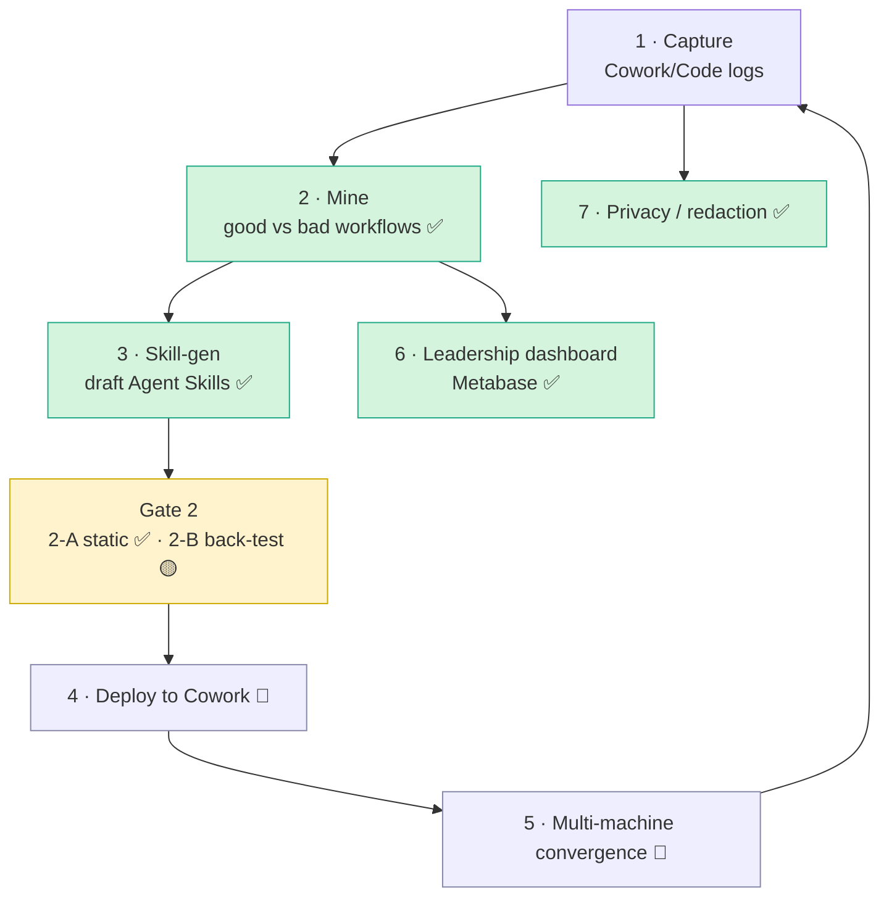
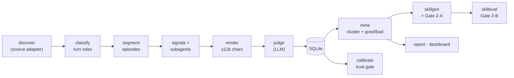
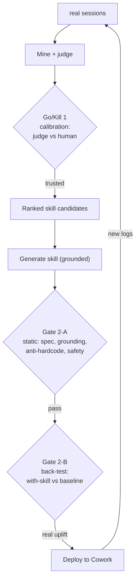
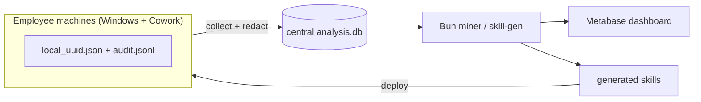

# Cowork Skill Factory

Mine your real **Claude Cowork / Claude Code** sessions → find which workflows are **good vs bad** →
**auto-draft spec-compliant [Agent Skills](https://agentskills.io/specification)** from the winning ones →
gate them for trust → surface it all on a **Metabase** leadership dashboard.

> Turn "how people actually work with Claude" into reusable, validated skills — with honest
> trust gates at every step, not vibes.

---

## The big picture

The full program is 7 areas. This repo implements the **intelligence core** (mine → generate →
gate) end-to-end, plus the BI layer; deployment/convergence are architected and partially built.



✅ built & tested · 🟡 partial (scaffold) · 🔶 designed, needs real Cowork data / Windows

---

## How it works — the mining pipeline

Each **episode** = one complete task attempt (including the user's corrections/rework). The engine
classifies every human turn, groups turns into episodes, attaches evidence, and has an LLM judge
grade each episode on **user-observable behaviour** (did the user accept / rework / interrupt / abandon?).



**Everything is redacted at the boundary** (`src/core/redact.ts`) before any text reaches an LLM
or is written to disk. The judge is **cache-keyed** (content + prompt + schema + model + cli) so a
full run is resumable and never re-pays for unchanged episodes.

---

## The two trust gates (the point of the project)

A prototype that says "this workflow is good" or "here's a skill" is worthless unless you can trust
it. So every claim passes a gate:



- **Go/Kill 1** — `calibrate`: a stratified human spot-check measures judge↔human agreement (counters
  "Claude grading Claude"). *Current run: 82% agreement on 11 reviewed episodes.*
- **Gate 2-A** — `skillgen`: static checks — valid SKILL.md frontmatter, every step grounded in
  evidence, no hardcoded/secret literals, non-triviality, safety.
- **Gate 2-B** — `skilleval`: runs the skill's `evals.json` *with-skill vs no-skill* and measures the
  uplift. The strongest signal is the **closed loop** — deploy, then re-mine future logs.

---

## Quickstart

```bash
bun install                                  # only dep: @types/bun (uses bun:sqlite)

# 1) Structure pass — free, no LLM (populate episodes from your logs)
bun run pipeline.ts --no-judge
bun run check                                # 9 hard invariants, $0

# 2) Judge episodes (real LLM calls — bounded by cost)
bun run pipeline.ts --max-cost 6 --yes --mine

# 3) Trust gate
bun run src/analysis/calibrate.ts            # interactive human spot-check

# 4) Generate skills from worth-codifying clusters
bun run skillgen --no-llm                    # $0: inspect the redacted evidence first
bun run skillgen --yes                       # draft → out/skills/<name>/SKILL.md

# 5) Back-test a generated skill
bun run skilleval --skill <name> --dry       # $0 plan; --execute to really run

# 6) Leadership dashboard (Metabase)
bun run views && bun run bi:refresh && bun run bi:up && bun run bi:provision
#   → http://localhost:3000/dashboard/2   (admin@cowork.local / Cowork-admin-1)
```

**LLM routing:** `--runner ccs|claude|api`. Default tries a `ccs` profile, falls back to the plain
`claude` CLI automatically; `--runner api` uses the HTTP Messages API (Windows / no-CLI). Cost gates,
a circuit breaker, and `--max-cost` keep spend bounded.

---

## Dashboards (leadership BI)

The dashboard is a **separate presentation layer** — not the Bun engine. Primary = **Metabase**
(a real BI tool: self-serve, auth, scheduled reports). `bun run bi:provision` builds it as
config-as-code (8 cards, idempotent). The static `out/dashboard.html` is kept only as an **offline
fallback** (air-gapped / single-`.exe`). See [`bi/README.md`](bi/README.md).



For a production fleet, point the miner at **Postgres** and connect Metabase to Postgres — no
dashboard rework, just a different data-source connection.

---

## Skill generation

For each worth-codifying cluster, `skillgen` assembles the judge's distilled evidence (winning
pattern, fail patterns, recurring friction, good practices, exemplars), **redacts it**, and asks the
model to draft a skill **grounded at the pattern level** (per Anthropic's `skill-creator` guidance:
imperative, explain *why*, no overfit). Output is a real, spec-compliant skill folder:

```
out/skills/<name>/
  SKILL.md            # YAML frontmatter (name ≤64, description ≤1024, compatibility) + body
  scripts/ references/ # optional bundled resources (hybrid skill + script)
  evals/evals.json    # 2-3 test cases → handoff to the Gate 2-B back-test
  meta.json           # provenance: cluster, citations, gate result, confidence
```

---

## Windows / Claude Cowork target

Claude Cowork ships **only on Windows/macOS** and stores conversations at
`%LOCALAPPDATA%\Claude-3p\local-agent-mode-sessions\local_<uuid>.json` (a single JSON, unlike Claude
Code's `.jsonl`). The pipeline targets it without a rewrite via a **source adapter**:

```bash
bun run pipeline.ts --source cowork --runner api --mine      # ingest Cowork logs, LLM via API
bun run build:win                                            # single .exe for MDM fleet rollout
```

- `--source claude-code` (default) | `cowork` — `src/ingest/source.ts`
- `COWORK_SESSIONS_ROOT=<dir>` to point at exported logs on any OS
- The Cowork JSON field-mapping is tolerant and should be **locked against one real sample**.

---

## Module map

| Area | Files |
|---|---|
| **core** | `src/core/{types,util,redact,paths}.ts` — shared contract, redaction, path resolution |
| **ingest** | `src/ingest/{source,discover,cowork,cowork-audit}.ts` — pluggable log sources |
| **pipeline** | `src/pipeline/{classify*,segment,signals,subagents,render}.ts` — turns → episodes → evidence |
| **llm** | `src/llm/{judge,runner,api}.ts` — bias-anchored judge, runner selection, HTTP API |
| **analysis** | `src/analysis/{mine,report,calibrate,check,dump-render,dashboard,merge,views}.ts` |
| **skills** | `src/skills/{skillgen*,skilleval}.ts` — draft + gate + back-test |
| **db** | `src/db/{db.ts,schema.sql,views.sql}` — SQLite persistence + BI views |
| **bi** | `bi/{docker-compose.yml,provision.ts,refresh.ts,README.md}` — Metabase, config-as-code |
| **prompts** | `prompts/{classify,judge,skillgen}.md` — the rubrics |
| **docs** | [`docs/BRAINSTORM.md`](docs/BRAINSTORM.md) · [`docs/implementation-plan.md`](docs/implementation-plan.md) · [`docs/DATA_FORMAT.md`](docs/DATA_FORMAT.md) |

---

## Project status (honest)

| Done ✅ | Partial 🟡 | Blocked on real data / infra 🔶 |
|---|---|---|
| Mining pipeline (VI-aware), judge + cache | Gate 2-B (proxy works; canal/canary needs real tasks) | Lock Cowork adapter (needs a real `local_<uuid>.json`) |
| Skill-gen + Gate 2-A (spec-compliant) | `.exe` build (script ready; validate on Windows) | Live `--runner api` (needs an API key here) |
| Metabase dashboard (config-as-code) | | Business-data corpus + multi-person clusters |
| Redaction-first, portability, calibration | | Legal / retention / access governance |

---

## ── Tiếng Việt (tóm tắt) ──

**Cowork Skill Factory** = khai thác log Claude Cowork/Code thật → tìm workflow **tốt/xấu** →
**tự soạn Agent Skill đúng chuẩn** → kiểm định qua các **cổng tin cậy** → hiển thị trên **dashboard
Metabase** cho lãnh đạo.

- **2 cổng tin cậy:** Go/Kill 1 (`calibrate` — đối chiếu judge vs người, hiện 82%) · Gate 2-A (kiểm
  tĩnh skill) · Gate 2-B (`skilleval` — back-test có/không skill).
- **Riêng tư:** redact secrets/PII/đường dẫn **tại biên** trước khi tới LLM hoặc ghi file.
- **Dashboard:** Metabase (`bun run bi:provision` tự dựng) — `http://localhost:3000/dashboard/2`.
- **Windows/Cowork:** `--source cowork`, `--runner api`, `bun run build:win`.

Chạy nhanh:
```bash
bun install
bun run pipeline.ts --no-judge && bun run check        # cấu trúc, $0
bun run pipeline.ts --max-cost 6 --yes --mine          # judge (tốn $)
bun run skillgen --yes                                  # sinh skill
bun run views && bun run bi:refresh && bun run bi:up && bun run bi:provision   # dashboard
```

Xem [`docs/BRAINSTORM.md`](docs/BRAINSTORM.md) để biết quyết định thiết kế từng mảng.
