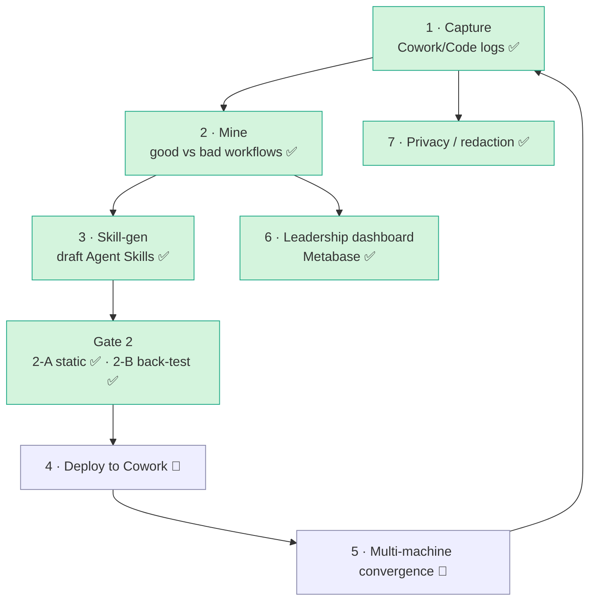
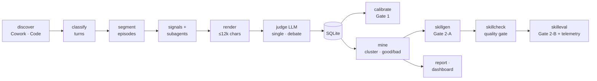
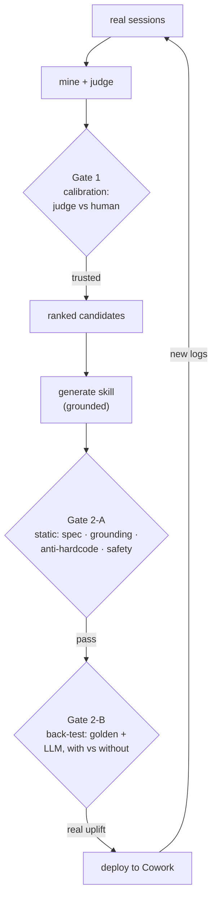
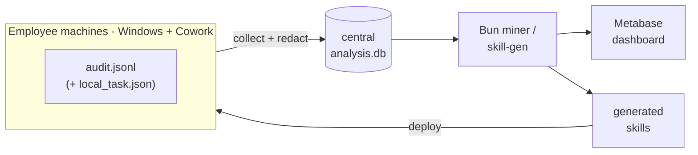

# Cowork Skill Factory

Mine your real **Claude Cowork / Claude Code** sessions → find which workflows are **good vs bad** →
**auto-draft spec-compliant [Agent Skills](https://agentskills.io/specification)** from the winning ones →
gate them for trust → surface it all on a **Metabase** leadership dashboard.

> Turn "how people actually work with Claude" into reusable, validated skills — with honest
> trust gates at every step, not vibes.

---

## The big picture

The full program is 7 areas. This repo implements the **intelligence core** (mine → generate →
gate) end-to-end, plus the BI layer; deployment/convergence are architected and partially built.



✅ built & tested (incl. real Cowork logs on Windows) · 🔶 designed, needs fleet rollout

---

## How it works — the mining pipeline

Each **episode** = one complete task attempt (including the user's corrections/rework). The engine
classifies every human turn, groups turns into episodes, attaches evidence, and has an LLM judge
grade each episode on **user-observable behaviour** (did the user accept / rework / interrupt / abandon?).
The judge runs single-LLM by default, or as a **multi-perspective debate ensemble** (`--judge-debate`)
for the critical decision; LLM calls are **model-tiered** (cheap for discovery, best for judging).



**Everything is redacted at the boundary** (`src/core/redact.ts`) before any text reaches an LLM
or is written to disk. The judge is **cache-keyed** (content + prompt + schema + model + cli) so a
full run is resumable and never re-pays for unchanged episodes.

---

## The two trust gates (the point of the project)

A prototype that says "this workflow is good" or "here's a skill" is worthless unless you can trust
it. So every claim passes a gate:



- **Go/Kill 1** — `calibrate`: a stratified human spot-check measures judge↔human agreement (counters
  "Claude grading Claude"). *Current run: 82% agreement on 11 reviewed episodes.*
- **Gate 2-A** — `skillgen`: static checks — valid SKILL.md frontmatter, every step grounded in
  evidence, no hardcoded/secret literals, non-triviality, safety.
- **Gate 2-B** — `skilleval`: runs the skill's `evals.json` *with-skill vs no-skill* in **two arms** —
  a `$0` deterministic **golden** check (no LLM) and an LLM-graded **semantic** check — and measures the
  uplift of each. Results are written as **telemetry** (`skill_telemetry` table + `out/telemetry/*.jsonl`).
  The strongest signal is still the **closed loop** — deploy, then re-mine future logs.
- **Quality-gate hook** — `skillcheck` validates every generated SKILL.md (frontmatter, when-to-use
  framing, gate verdict, no PII, no creation-history leak); wired as a Claude Code hook
  (`.claude/settings.json`) so a bad skill written in-session is **blocked**.

---

## Quickstart

### One command — logs → validated skills

```bash
bun install                          # once: deps (only @types/bun)

bun run all                          # mine Claude Code logs (~/.claude/projects)
MINER_SOURCE=cowork bun run all      # mine Claude Cowork logs (audit.jsonl)  ← Windows/Cowork
```

`bun run all` chains stages 1–4: `pipeline --mine --yes && skillgen --yes --min-frequency 1 && skillcheck`.
Pick the corpus with the **`MINER_SOURCE`** env var (`cowork` or `claude-code`, default `claude-code`).

Two things `all` deliberately does NOT do:
- **No dashboard** — stage 6 needs Docker, so run it separately (below).
- **No cost ceiling** — `all` judges the whole corpus. Set **`MINER_MAX_COST`** (USD) to bound it,
  e.g. `MINER_MAX_COST=10 bun run all`. On a large corpus, judging everything on the opus tier
  can run into tens of dollars (≈ $0.40/episode), so set a cap unless you mean to judge it all.

> `--min-frequency 1` makes `skillgen` draft **leads** (any cluster with ≥1 episode), so a thin
> corpus still produces skills to review. Drop it for the stricter "worth-codifying" gate.

> Note: `bun run pipeline --mine --yes` on its own already runs the **whole mining pipeline**
> in one command (ingest → classify → judge → cluster → report). `all` just also drafts + validates skills.

### Or stage by stage — one command each, top to bottom

```bash
bun run pipeline --no-judge              # 1. logs → episodes      (free, no LLM)
bun run pipeline --mine --yes --max-cost 6   # 2. judge + cluster  (LLM; --max-cost optional cap)
bun run skillgen --yes                   # 3. clusters → skills    → out/skills/
bun run skillcheck                       # 4. validate structure   (free)
bun run skilleval --skill <name>         # 5. back-test the skill  (LLM)
bun run views && bun run bi:refresh && bun run bi:up && bun run bi:provision   # 6. dashboard
#                                        → http://localhost:3000  (admin@cowork.local / Cowork-admin-1)
```

**What the flags mean** (only the ones above; all are optional unless a stage needs them):

| Flag | Used by | What it does |
|---|---|---|
| `--no-judge` | `pipeline` | Only segment logs into episodes; **skip the paid LLM judge**. Free first pass. |
| `--mine` | `pipeline` | After judging, **cluster** similar episodes and rank which are worth codifying. |
| `--max-cost N` | `pipeline` | **Circuit breaker** — stop judging once estimated spend reaches $N. |
| `--yes` | `pipeline`, `skillgen` | Skip the "spend money?" confirmation prompt (for scripts/CI). |
| `--skill <name>` | `skilleval` | Which generated skill (folder name under `out/skills/`) to back-test. |

**Optional, when you want more:**

| Flag | Used by | What it does |
|---|---|---|
| `--judge-debate` `--judge-rounds N` | `pipeline` | Multi-perspective **ensemble** judge (productivity/accuracy/cost lenses → critique→refute for N rounds → consolidate). ~8× the cost, far more robust. Default N=2. |
| `--no-llm` | `skillgen` | $0 dry run: print the **redacted evidence** the model would see, write nothing. |
| `--dry` / `--execute` | `skilleval` | Plan only ($0) vs. actually run the eval. Defaults to `--dry`. |
| `--runner ccs\|claude\|api` | any LLM stage | How to reach the model: `ccs` (default, falls back to plain `claude`) · `claude` (CLI) · `api` (HTTP Messages API — for Windows / no-CLI). |
| `bun run check` | — | Run hard data invariants ($0); use after stage 1 to sanity-check ingest. |

---

## Dashboards (leadership BI)

The dashboard is a **separate presentation layer** — not the Bun engine. Primary = **Metabase**
(a real BI tool: self-serve, auth, scheduled reports). `bun run bi:provision` builds it as
config-as-code (16 cards, idempotent) in clearly-banded sections:
**Overview** (episodes, success %, judge↔human agreement) · **Cost & tokens** (LLM spend $, total
tokens, calls, plus cost by phase / by model / over time — the pipeline's *own* mining spend) ·
**Outcomes** · **Output** (skills). Cost data is captured per LLM call into `out/telemetry/llm_calls.jsonl`
and folded into the `llm_calls` table automatically by `bun run views` / `bi:refresh`. The static
`out/dashboard.html` is kept only as an **offline fallback** (air-gapped / single-`.exe`). See
[`bi/README.md`](bi/README.md).



For a production fleet, point the miner at **Postgres** and connect Metabase to Postgres — no
dashboard rework, just a different data-source connection.

---

## Skill generation

For each worth-codifying cluster, `skillgen` assembles the judge's distilled evidence (winning
pattern, fail patterns, recurring friction, good practices, exemplars), **redacts it**, and asks the
model to draft a skill **grounded at the pattern level** (per Anthropic's `skill-creator` guidance:
imperative, explain *why*, no overfit). Skills follow the leadership rec: the `description` leads
with **when to use** (the trigger); deterministic steps go to `scripts/`, judgement stays in the body;
multi-capability skills split into `references/`; fixed output shapes (templates/schemas) go to
`assets/`; and each declares its **`related_skills`** (chain: depends_on / followed_by / see_also).
No creation-history leaks into SKILL.md — provenance lives in `meta.json`. Output is a real,
spec-compliant skill folder (the optional dirs appear only when the evidence warrants them):

```
out/skills/<name>/
  SKILL.md                    # required: frontmatter (name, when-to-use description) + body
  LICENSE.txt                 # license referenced by the frontmatter (mirrors Anthropic's skills)
  scripts/ references/ assets/ # optional: deterministic helpers · per-capability detail · output templates
  evals/evals.json            # test cases: LLM-graded expectations + deterministic golden checks
  meta.json                   # provenance + execution hint: cluster, citations, gate, related_skills
```

What each part is *for* — and why our generator emits (or omits) it — is documented in
[`docs/SKILL_STANDARD.md`](docs/SKILL_STANDARD.md).

---

## Windows / Claude Cowork target

Verified against real Windows logs — full map in [`docs/COWORK_STORAGE.md`](docs/COWORK_STORAGE.md).
Claude Cowork ("local agent mode") writes a verbatim, HMAC-signed transcript per session:

```
…\Packages\Claude_<hash>\LocalCache\Roaming\Claude\local-agent-mode-sessions\<g>\<c>\local_<task>\audit.jsonl
```

It is the Agent-SDK **stream-json** shape. `src/ingest/cowork.ts` discovers it (pairing the sibling
`local_<task>.json` metadata for title/model/email/timestamps) and normalizes each line to the
canonical `RawEvent`, so the whole pipeline runs unchanged. Claude **Code** CLI transcripts
(`~/.claude/projects/**/*.jsonl`) work too.

```bash
bun run pipeline.ts --source cowork --runner claude --mine   # ingest Cowork logs, LLM via claude -p
bun run build:win                                            # single .exe for MDM fleet rollout
```

- `--source claude-code` (default) | `cowork` — `src/ingest/source.ts`
- `COWORK_SESSIONS_ROOT=<dir>` overrides the root (Linux / CI / mounted logs)
- Claude **Desktop chat** (LevelDB/IndexedDB) is intentionally out of scope — Cowork + Code cover the use case.

---

## Module map

| Area | Files |
|---|---|
| **core** | `src/core/{types,util,redact,paths}.ts` — shared contract, redaction, path resolution |
| **ingest** | `src/ingest/{source,discover,cowork,cowork-audit}.ts` — pluggable log sources |
| **pipeline** | `src/pipeline/{classify*,segment,signals,subagents,render}.ts` — turns → episodes → evidence |
| **llm** | `src/llm/{judge,judge.debate,runner,api}.ts` — single + debate-ensemble judge, model tiering, HTTP API, **per-call cost/token ledger** |
| **analysis** | `src/analysis/{mine,report,calibrate,check,dump-render,dashboard,merge,views}.ts` |
| **skills** | `src/skills/{skillgen*,skilleval,skillcheck,skillhook}.ts` — draft + gate + back-test + quality-gate hook |
| **db** | `src/db/{db.ts,schema.sql,views.sql,llm_ledger.ts}` — SQLite persistence + BI views + LLM-spend loader |
| **bi** | `bi/{docker-compose.yml,provision.ts,refresh.ts,README.md}` — Metabase, config-as-code |
| **prompts** | `prompts/{classify,judge,skillgen}.md` — the rubrics |
| **docs** | [`docs/COWORK_STORAGE.md`](docs/COWORK_STORAGE.md) · [`docs/DATA_FORMAT.md`](docs/DATA_FORMAT.md) · [`docs/SKILL_STANDARD.md`](docs/SKILL_STANDARD.md) · [`docs/implementation-plan.md`](docs/implementation-plan.md) |

---

## Project status (honest)

| Done ✅ | Designed / needs fleet 🔶 |
|---|---|
| Cowork ingest (`audit.jsonl`) verified on Windows + Code JSONL | Deploy skills to Cowork + multi-machine convergence (`merge`) |
| Mining pipeline (VI-aware), judge + cache + **debate ensemble** | Business-data corpus + multi-person clusters |
| Skill-gen + Gate 2-A + **chaining / det→code / sub-agents** | Live `--runner api` (needs an API key here) |
| Gate 2-B **golden (no-LLM) + LLM arm + telemetry**; **quality-gate hook** | Legal / retention / access governance |
| Model tiering, Metabase dashboard, redaction-first, calibration | `.exe` fleet build (script ready) |

---

## ── Tiếng Việt (tóm tắt) ──

**Cowork Skill Factory** = khai thác log Claude Cowork/Code thật → tìm workflow **tốt/xấu** →
**tự soạn Agent Skill đúng chuẩn** → kiểm định qua các **cổng tin cậy** → hiển thị trên **dashboard
Metabase** cho lãnh đạo.

- **2 cổng tin cậy:** Go/Kill 1 (`calibrate` — đối chiếu judge vs người, hiện 82%) · Gate 2-A (kiểm
  tĩnh skill) · Gate 2-B (`skilleval` — back-test có/không skill, **2 nhánh: golden không-LLM + LLM**,
  ghi telemetry) · **hook `skillcheck`** chốt chất lượng skill.
- **Judge:** mặc định 1 LLM, hoặc **ensemble phản biện đa góc nhìn** (`--judge-debate`); LLM **phân tầng
  model** (discovery rẻ, judge ngon). Skill có **`related_skills` (chain)**, đẩy bước máy-làm-được sang
  `scripts/`, output cố định sang `assets/`; gợi ý chạy độc lập + tầng model ghi ở `meta.json`.
- **Riêng tư:** redact secrets/PII/đường dẫn **tại biên** trước khi tới LLM hoặc ghi file.
- **Dashboard:** Metabase (`bun run bi:provision` tự dựng + in URL, vd `/dashboard/3`) — `http://localhost:3000`.
- **Windows/Cowork:** transcript thật ở `audit.jsonl` (xem `docs/COWORK_STORAGE.md`); chạy
  `--source cowork --runner claude`, đóng gói `bun run build:win`.

Chạy nhanh:
```bash
bun install
bun run pipeline.ts --no-judge && bun run check        # cấu trúc, $0
bun run pipeline.ts --max-cost 6 --yes --mine          # judge (tốn $)
bun run skillgen --yes                                  # sinh skill
bun run views && bun run bi:refresh && bun run bi:up && bun run bi:provision   # dashboard
```

Chi tiết: [`docs/COWORK_STORAGE.md`](docs/COWORK_STORAGE.md) (lưu trữ Cowork/Code) ·
[`docs/DATA_FORMAT.md`](docs/DATA_FORMAT.md) (schema transcript) ·
[`docs/implementation-plan.md`](docs/implementation-plan.md) (kế hoạch mining).
