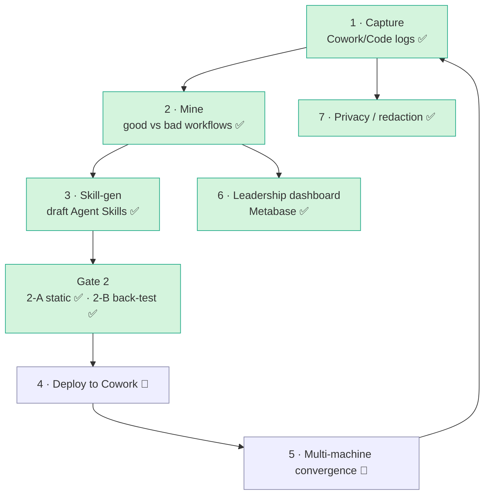
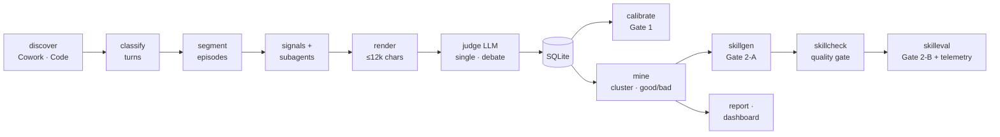
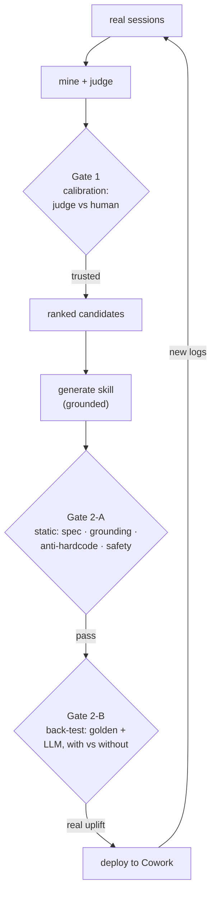
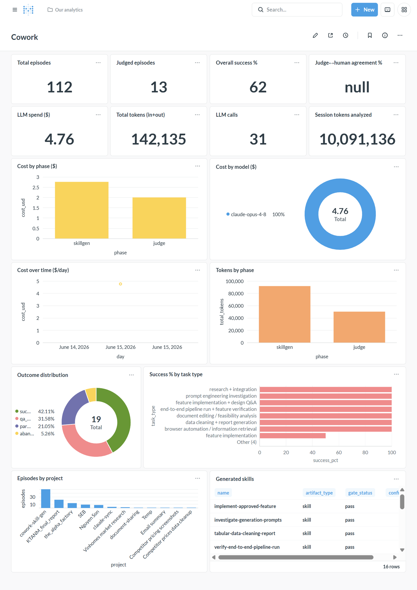
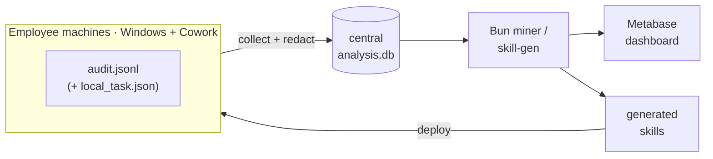

# Cowork Skill Factory

Mine your real **Claude Cowork / Claude Code** sessions → find which workflows are **good vs bad** →
**auto-draft spec-compliant [Agent Skills](https://agentskills.io/specification)** from the winning ones →
gate them for trust → surface it all on a **Metabase** leadership dashboard.

> Turn "how people actually work with Claude" into reusable, validated skills — with honest
> trust gates at every step, not vibes.

---

## The big picture

The full program is 7 areas. This repo implements the **intelligence core** (mine → generate →
gate) end-to-end, plus the BI layer; deployment/convergence are architected and partially built.



✅ built & tested (incl. real Cowork logs on Windows) · 🔶 designed, needs fleet rollout

---

## How it works — the mining pipeline

Each **episode** = one complete task attempt (including the user's corrections/rework). The engine
classifies every human turn, groups turns into episodes, attaches evidence, and has an LLM judge
grade each episode on **user-observable behaviour** (did the user accept / rework / interrupt / abandon?).
The judge runs single-LLM by default, or as a **multi-perspective debate ensemble** (`--judge-debate`)
for the critical decision; LLM calls are **model-tiered** (cheap for discovery, best for judging).



**Everything is redacted at the boundary** (`src/core/redact.ts`) before any text reaches an LLM
or is written to disk — including the judge input itself (`renderEpisodeRedacted`), with the
scrubbed-item count logged each run (no silent redaction). The judge is **cache-keyed** (content +
prompt + schema + model + cli) so a full run is resumable and never re-pays for unchanged episodes;
the **debate** judge keys on a content hash of its lenses + templates + round budget (not a bare
literal), so editing any lens re-judges instead of serving a stale label.

---

## The two trust gates (the point of the project)

A prototype that says "this workflow is good" or "here's a skill" is worthless unless you can trust
it. So every claim passes a gate:



- **Go/Kill 1** — `calibrate`: a stratified human spot-check measures judge↔human agreement (counters
  "Claude grading Claude"). The sample is **deterministic** (reproducible/auditable; `--seed` to rotate),
  and every agreement figure is reported with a **Wilson 95% CI** — so a small-N number reads honestly
  (e.g. *82% on 11 → 95% CI 52–95%*, i.e. "directional, not a verdict") instead of as false precision.
- **Gate 2-A** — `skillgen`: static checks — valid SKILL.md frontmatter, every step grounded in
  evidence, no hardcoded/secret literals, non-triviality, safety.
- **Gate 2-B** — `skilleval`: runs the skill's `evals.json` *with-skill vs no-skill* in **two arms** —
  a `$0` deterministic **golden** check (no LLM) and an LLM-graded **semantic** check — and measures the
  uplift of each. The eval cases are **held-out**: each cluster is split train/held-out, the skill is
  drafted **only from train**, and the eval prompts are the **real tasks of the held-out episodes the
  skill never saw** — so a pass is evidence of *transfer*, not teaching-to-the-test. Provenance
  (`held-out` vs thin-corpus `in-distribution` fallback) is stamped in `meta.json` and printed by the
  harness. Results are written as **telemetry** (`skill_telemetry` table + `out/telemetry/*.jsonl`).
  See [`docs/HELDOUT_AND_SHADOW.md`](docs/HELDOUT_AND_SHADOW.md).
- **Gate 3** — `skillshadow`: the **closed loop**, in observational *shadow* mode. `--deploy` snapshots
  the pre-deploy baseline for the skill's task family; after future logs are re-mined, `--report`
  compares the **post-deploy outcomes of real, unchosen tasks** to that baseline (success rate + median
  friction). Immune to teaching-to-the-test; a quasi-experiment (before/after, not an RCT) and reported
  honestly as such. The strongest signal in the system because the data is future and unchosen.
- **Quality-gate hook** — `skillcheck` validates every generated SKILL.md (frontmatter, when-to-use
  framing, gate verdict, no PII, no creation-history leak); wired as a Claude Code hook
  (`.claude/settings.json`) so a bad skill written in-session is **blocked**.

---

## Quickstart

### Docker — whole system, one stack (recommended)

The image bundles the Claude Code CLI, so **every** stage works; auth is env-only (no login).
Full detail in [`docs/PACKAGING.md`](docs/PACKAGING.md).

```bash
bun run setup:env               # writes .env: auto-detects Cowork + Claude Code log paths + the ccs profile
docker build -t cowork-miner .

docker compose run --rm miner                 # interactive menu — pick corpus + stage
docker compose run --rm miner all             # or headless: mine → draft → validate
docker compose run --rm miner skilleval --skill <name> --execute --yes   # back-test one skill

docker compose --profile dashboard up -d      # dashboard (Metabase + auto-provision)
#   → http://localhost:3000/dashboard/2   (admin@cowork.local / Cowork-admin-1)
```

`setup:env` works on **any** machine — it scans `~/.ccs/*.settings.json` and uses the first profile
that yields creds (no profile name hardcoded). No ccs? `cp .env.example .env` and fill the two
`ANTHROPIC_*` values by hand, or set `MINER_CCS_PROFILE=<name>`. Corpus = `MINER_SOURCE=cowork|claude-code`
in `.env`; cap spend with `MINER_MAX_COST`. Both corpora are mounted read-only into the container
(`COWORK_LOGS` → `/logs`, `CLAUDE_LOGS` → `/claude-logs`), so either source works without re-mounting.

### Local Bun (no Docker)

```bash
bun install                     # once (deps: only @types/bun)
bun run start                   # interactive launcher — pick corpus + stage
MINER_SOURCE=cowork bun run all # or one shot: mine → draft → validate
```

`all` = `pipeline --mine --yes && skillgen --yes --min-frequency 1 && skillcheck` (uncapped —
set `MINER_MAX_COST` on a large corpus, ≈ $0.40/episode on the opus tier).

### Stage by stage (Bun)

```bash
bun run pipeline --no-judge          # 1. logs → episodes          (free)
bun run pipeline --mine --yes        # 2. judge + cluster + report (LLM; --max-cost N caps)
bun run skillgen --yes               # 3. clusters → skills        → out/skills/
bun run skillcheck                   # 4. validate                 (free)
bun run skilleval --skill <name>     # 5. back-test on held-out    (LLM)
bun run skillshadow --skill <name> --deploy   # 6. mark live; --report after re-mining
bun run views && docker compose --profile dashboard up -d   # dashboard → :3000
```

### Run ONE session through the whole pipeline

Same `bun run all` (judge → cluster → draft skills → validate) — but scoped to a **single
session** and isolated from the main corpus. No separate `pipeline` / `skillgen` steps: just set
three env vars and run `all` as usual.

```bash
bun run discover           # list sessions → copy a short-id, e.g. 71fbfc58

MINER_SESSION=71fbfc58 MINER_DB=one.db MINER_SKILLS_OUT=one-skills bun run all

ls one-skills/             # the skills that session produced
```

| Env var | What it does |
|---|---|
| `MINER_SESSION` | Which session to run — exact `sessionId` or its 8-char prefix (from `discover`). |
| `MINER_DB` | Use an **isolated DB** so judging/clustering never touches the main `analysis.db`. |
| `MINER_SKILLS_OUT` | Write skills to an **isolated dir** instead of the committed `out/skills/`. |
| `MINER_MAX_COST` | (optional) Cap spend, e.g. `MINER_MAX_COST=10`. |

> Drop `MINER_DB` + `MINER_SKILLS_OUT` if you *want* the session folded into the main corpus and
> `out/skills/`. The same env vars work on any single stage too (`MINER_SESSION=… bun run pipeline`).
> Prefer flags? `--session <id>`, `--db <path>` (pipeline/skillgen), `--out <dir>` (skillgen) do the same.

**What the flags mean** (only the ones above; all are optional unless a stage needs them):

| Flag | Used by | What it does |
|---|---|---|
| `--no-judge` | `pipeline` | Only segment logs into episodes; **skip the paid LLM judge**. Free first pass. |
| `--mine` | `pipeline` | After judging, **cluster** similar episodes and rank which are worth codifying. |
| `--max-cost N` | `pipeline` | **Circuit breaker** — stop judging once estimated spend reaches $N. |
| `--yes` | `pipeline`, `skillgen` | Skip the "spend money?" confirmation prompt (for scripts/CI). |
| `--session <id>` | `pipeline`, `discover` | **Scope to ONE session** — exact `sessionId` or its 8-char prefix (from `discover`). |
| `--project <substr>` | `pipeline`, `discover` | Scope to sessions whose **project name** contains `<substr>`. |
| `--limit N` | `pipeline`, `discover` | Scope to the **earliest N** sessions. |
| `--db <path>` | `pipeline`, `skillgen` | Use an **isolated** DB so a scoped run never mixes with the main corpus. |
| `--out <dir>` | `skillgen` | Write skills to a custom dir (default `out/skills/`). Pair with `--db` for isolation. |
| `--skill <name>` | `skilleval` | Which generated skill (folder name under `out/skills/`) to back-test. |

**Optional, when you want more:**

| Flag | Used by | What it does |
|---|---|---|
| `--judge-debate` `--judge-rounds N` | `pipeline` | Multi-perspective **ensemble** judge (productivity/accuracy/cost lenses → critique→refute for N rounds → consolidate). ~8× the cost, far more robust. Default N=2. |
| `--no-llm` | `skillgen` | $0 dry run: print the **redacted evidence** the model would see, write nothing. |
| `--dry` / `--execute` | `skilleval` | Plan only ($0) vs. actually run the eval. Defaults to `--dry`. |
| `--runner ccs\|claude\|api` `--ccs-profile <name>` | any LLM stage | How to reach the model: `ccs` (**default — profile `son`**; override with `--ccs-profile` or env `MINER_CCS_PROFILE`; falls back to plain `claude` if the profile is missing) · `claude` (ambient CLI login) · `api` (HTTP Messages API — Windows / no-CLI). |
| `bun run check` | — | Run hard data invariants ($0); use after stage 1 to sanity-check ingest. |

---

## Dashboards (leadership BI)



*The Metabase "Cowork — Leadership" dashboard: Overview KPIs, the Cost & tokens band
(LLM spend $4.76 / 142k tokens this run, split by phase & model), outcomes, and the
generated-skills table.*


The dashboard is a **separate presentation layer** — not the Bun engine. Primary = **Metabase**
(a real BI tool: self-serve, auth, scheduled reports). `bun run bi:provision` builds it as
config-as-code (16 cards, idempotent) in clearly-banded sections:
**Overview** (episodes, success %, judge↔human agreement) · **Cost & tokens** (LLM spend $, total
tokens, calls, plus cost by phase / by model / over time — the pipeline's *own* mining spend) ·
**Outcomes** · **Output** (skills). Cost data is captured per LLM call into `out/telemetry/llm_calls.jsonl`
and folded into the `llm_calls` table automatically by `bun run views` / `bi:refresh`. The static
`out/dashboard.html` is kept only as an **offline fallback** (air-gapped / single-`.exe`). See
[`bi/README.md`](bi/README.md).



For a production fleet, point the miner at **Postgres** and connect Metabase to Postgres — no
dashboard rework, just a different data-source connection.

---

## Skill generation

For each worth-codifying cluster, `skillgen` assembles the judge's distilled evidence (winning
pattern, fail patterns, recurring friction, good practices, exemplars), **redacts it**, and asks the
model to draft a skill **grounded at the pattern level** (per Anthropic's `skill-creator` guidance:
imperative, explain *why*, no overfit). Skills follow the leadership rec: the `description` leads
with **when to use** (the trigger); deterministic steps go to `scripts/`, judgement stays in the body;
multi-capability skills split into `references/`; fixed output shapes (templates/schemas) go to
`assets/`; and each declares its **`related_skills`** (chain: depends_on / followed_by / see_also).
No creation-history leaks into SKILL.md — provenance lives in `meta.json`. Output is a real,
spec-compliant skill folder (the optional dirs appear only when the evidence warrants them):

```
out/skills/<name>/
  SKILL.md                    # required: frontmatter (name, when-to-use description) + body
  LICENSE.txt                 # license referenced by the frontmatter (mirrors Anthropic's skills)
  scripts/ references/ assets/ # optional: deterministic helpers · per-capability detail · output templates
  evals/evals.json            # test cases: LLM-graded expectations + deterministic golden checks
  meta.json                   # provenance + execution hint: cluster, citations, gate, related_skills
```

What each part is *for* — and why our generator emits (or omits) it — is documented in
[`docs/SKILL_STANDARD.md`](docs/SKILL_STANDARD.md).

---

## Windows / Claude Cowork target

Verified against real Windows logs — full map in [`docs/COWORK_STORAGE.md`](docs/COWORK_STORAGE.md).
Claude Cowork ("local agent mode") writes a verbatim, HMAC-signed transcript per session:

```
…\Packages\Claude_<hash>\LocalCache\Roaming\Claude\local-agent-mode-sessions\<g>\<c>\local_<task>\audit.jsonl
```

It is the Agent-SDK **stream-json** shape. `src/ingest/cowork.ts` discovers it (pairing the sibling
`local_<task>.json` metadata for title/model/email/timestamps) and normalizes each line to the
canonical `RawEvent`, so the whole pipeline runs unchanged. Claude **Code** CLI transcripts
(`~/.claude/projects/**/*.jsonl`) work too.

```bash
bun run pipeline --source cowork --mine --yes               # ingest Cowork logs (LLM via default ccs:son)
bun run pipeline --source cowork --session <id> --mine --yes # just one Cowork session
bun run build:win                                            # single .exe for MDM fleet rollout
```

- `--source claude-code` (default) | `cowork` — `src/ingest/source.ts`
- LLM runner defaults to `ccs:son`; on a box without that profile use `--runner claude` (ambient CLI) or `--runner api`
- `COWORK_SESSIONS_ROOT=<dir>` overrides the root (Linux / CI / mounted logs)
- Claude **Desktop chat** (LevelDB/IndexedDB) is intentionally out of scope — Cowork + Code cover the use case.

---

## Module map

| Area | Files |
|---|---|
| **core** | `src/core/{types,util,redact,paths}.ts` — shared contract, redaction, path resolution |
| **ingest** | `src/ingest/{source,discover,cowork,cowork-audit}.ts` — pluggable log sources |
| **pipeline** | `src/pipeline/{classify*,segment,signals,subagents,render}.ts` — turns → episodes → evidence |
| **llm** | `src/llm/{judge,judge.debate,runner,api}.ts` — single + debate-ensemble judge, model tiering, HTTP API, **per-call cost/token ledger** |
| **analysis** | `src/analysis/{mine,report,calibrate,check,dump-render,dashboard,merge,views}.ts` |
| **skills** | `src/skills/{skillgen*,skilleval,skillcheck,skillhook}.ts` — draft + gate + back-test + quality-gate hook |
| **db** | `src/db/{db.ts,schema.sql,views.sql,llm_ledger.ts}` — SQLite persistence + BI views + LLM-spend loader |
| **bi** | `bi/{docker-compose.yml,provision.ts,refresh.ts,README.md}` — Metabase, config-as-code |
| **prompts** | `prompts/{classify,judge,skillgen}.md` — the rubrics |
| **docs** | [`docs/COWORK_STORAGE.md`](docs/COWORK_STORAGE.md) · [`docs/DATA_FORMAT.md`](docs/DATA_FORMAT.md) · [`docs/SKILL_STANDARD.md`](docs/SKILL_STANDARD.md) · [`docs/implementation-plan.md`](docs/implementation-plan.md) |

---

## Project status (honest)

| Done ✅ | Designed / needs fleet 🔶 |
|---|---|
| Cowork ingest (`audit.jsonl`) verified on Windows + Code JSONL | Deploy skills to Cowork + multi-machine convergence (`merge`) |
| Mining pipeline (VI-aware), judge + cache + **debate ensemble** | Business-data corpus + multi-person clusters |
| Skill-gen + Gate 2-A + **chaining / det→code / sub-agents** | Live `--runner api` (needs an API key here) |
| Gate 2-B **held-out** back-test (golden + LLM + telemetry); **quality-gate hook** | Legal / retention / access governance |
| Gate 3 **shadow closed-loop** (`skillshadow`, pre/post on future tasks) | Live in-agent activation (vs. prepend proxy) |
| Model tiering, Metabase dashboard, redaction-first, calibration | `.exe` fleet build (script ready) |

---

## ── Tiếng Việt (tóm tắt) ──

**Cowork Skill Factory** = khai thác log Claude Cowork/Code thật → tìm workflow **tốt/xấu** →
**tự soạn Agent Skill đúng chuẩn** → kiểm định qua các **cổng tin cậy** → hiển thị trên **dashboard
Metabase** cho lãnh đạo.

- **Các cổng tin cậy:** Go/Kill 1 (`calibrate` — đối chiếu judge vs người, hiện 82%) · Gate 2-A (kiểm
  tĩnh skill) · Gate 2-B (`skilleval` — back-test có/không skill trên **held-out** (task skill chưa
  thấy → chống học-tủ), **2 nhánh: golden không-LLM + LLM**, ghi telemetry) · **Gate 3** (`skillshadow`
  — vòng kín ngầm: so outcome task tương lai trước/sau khi deploy) · **hook `skillcheck`** chốt chất
  lượng skill.
- **Judge:** mặc định 1 LLM, hoặc **ensemble phản biện đa góc nhìn** (`--judge-debate`); LLM **phân tầng
  model** (discovery rẻ, judge ngon). Skill có **`related_skills` (chain)**, đẩy bước máy-làm-được sang
  `scripts/`, output cố định sang `assets/`; gợi ý chạy độc lập + tầng model ghi ở `meta.json`.
- **Riêng tư:** redact secrets/PII/đường dẫn **tại biên** trước khi tới LLM hoặc ghi file.
- **Dashboard:** Metabase (`bun run bi:provision` tự dựng + in URL, vd `/dashboard/3`) — `http://localhost:3000`.
- **Windows/Cowork:** transcript thật ở `audit.jsonl` (xem `docs/COWORK_STORAGE.md`); chạy
  `--source cowork` (LLM mặc định qua `ccs:son`; máy không có profile thì thêm `--runner claude`),
  đóng gói `bun run build:win`.

**Chạy nhanh** (LLM mặc định đi qua `ccs:son`; đổi bằng `--ccs-profile <tên>` hoặc env `MINER_CCS_PROFILE`):
```bash
bun install
bun run all                                  # tất cả: log → judge → cluster → sinh skill → kiểm (1 lệnh)
MINER_MAX_COST=10 bun run all                # như trên, có chặn chi phí $10 (judge ≈ $0.4/episode)
```

Từng bước (nếu muốn kiểm soát):
```bash
bun run pipeline --no-judge && bun run check     # 1. log → episode + kiểm cấu trúc   ($0)
bun run pipeline --mine --yes --max-cost 6       # 2. judge + cluster                  (tốn $)
bun run skillgen --yes                           # 3. sinh skill → out/skills/
bun run skillcheck                               # 4. kiểm chất lượng skill           ($0)
bun run views && bun run bi:refresh && bun run bi:up && bun run bi:provision   # 5. dashboard
```

Chạy **trọn pipeline cho đúng một session** (vẫn là `bun run all`, chỉ thêm env — không tách lệnh):
```bash
bun run discover           # liệt kê session → lấy short-id, vd 71fbfc58

MINER_SESSION=71fbfc58 MINER_DB=one.db MINER_SKILLS_OUT=one-skills bun run all

ls one-skills/             # skill mà session đó sinh ra
```
- `MINER_SESSION` = session cần chạy (id đầy đủ hoặc 8 ký tự đầu) · `MINER_DB` = DB riêng (không đụng `analysis.db`)
  · `MINER_SKILLS_OUT` = thư mục skill riêng (không đè `out/skills/`) · thêm `MINER_MAX_COST=10` để chặn chi phí.
- Bỏ `MINER_DB`+`MINER_SKILLS_OUT` nếu muốn gộp luôn vào corpus chính.

Chi tiết: [`docs/COWORK_STORAGE.md`](docs/COWORK_STORAGE.md) (lưu trữ Cowork/Code) ·
[`docs/DATA_FORMAT.md`](docs/DATA_FORMAT.md) (schema transcript) ·
[`docs/implementation-plan.md`](docs/implementation-plan.md) (kế hoạch mining).
