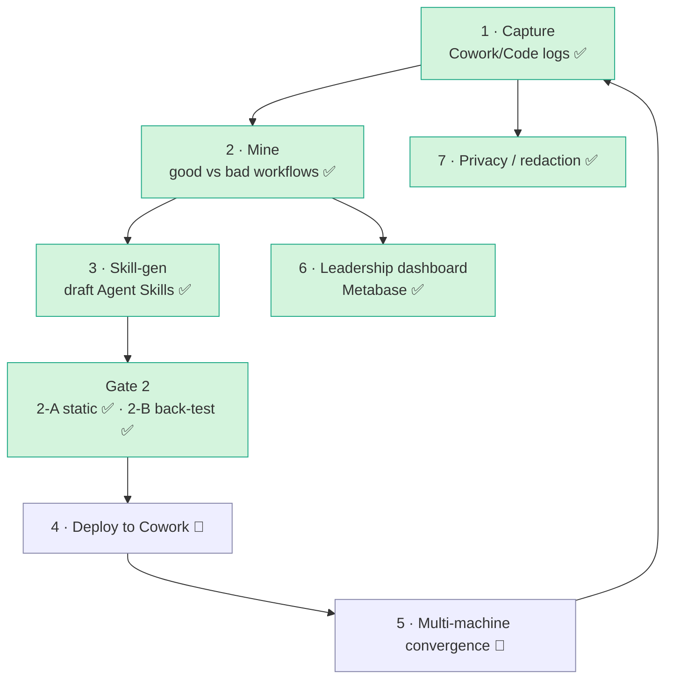
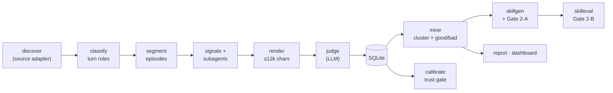
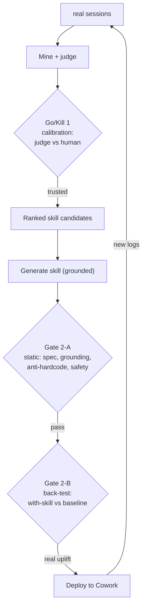
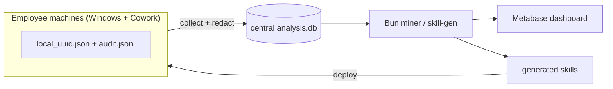

# Cowork Skill Factory

Mine your real **Claude Cowork / Claude Code** sessions → find which workflows are **good vs bad** →
**auto-draft spec-compliant [Agent Skills](https://agentskills.io/specification)** from the winning ones →
gate them for trust → surface it all on a **Metabase** leadership dashboard.

> Turn "how people actually work with Claude" into reusable, validated skills — with honest
> trust gates at every step, not vibes.

---

## The big picture

The full program is 7 areas. This repo implements the **intelligence core** (mine → generate →
gate) end-to-end, plus the BI layer; deployment/convergence are architected and partially built.



✅ built & tested (incl. real Cowork logs on Windows) · 🔶 designed, needs fleet rollout

---

## How it works — the mining pipeline

Each **episode** = one complete task attempt (including the user's corrections/rework). The engine
classifies every human turn, groups turns into episodes, attaches evidence, and has an LLM judge
grade each episode on **user-observable behaviour** (did the user accept / rework / interrupt / abandon?).
The judge runs single-LLM by default, or as a **multi-perspective debate ensemble** (`--judge-debate`)
for the critical decision; LLM calls are **model-tiered** (cheap for discovery, best for judging).



**Everything is redacted at the boundary** (`src/core/redact.ts`) before any text reaches an LLM
or is written to disk. The judge is **cache-keyed** (content + prompt + schema + model + cli) so a
full run is resumable and never re-pays for unchanged episodes.

---

## The two trust gates (the point of the project)

A prototype that says "this workflow is good" or "here's a skill" is worthless unless you can trust
it. So every claim passes a gate:



- **Go/Kill 1** — `calibrate`: a stratified human spot-check measures judge↔human agreement (counters
  "Claude grading Claude"). *Current run: 82% agreement on 11 reviewed episodes.*
- **Gate 2-A** — `skillgen`: static checks — valid SKILL.md frontmatter, every step grounded in
  evidence, no hardcoded/secret literals, non-triviality, safety.
- **Gate 2-B** — `skilleval`: runs the skill's `evals.json` *with-skill vs no-skill* in **two arms** —
  a `$0` deterministic **golden** check (no LLM) and an LLM-graded **semantic** check — and measures the
  uplift of each. Results are written as **telemetry** (`skill_telemetry` table + `out/telemetry/*.jsonl`).
  The strongest signal is still the **closed loop** — deploy, then re-mine future logs.
- **Quality-gate hook** — `skillcheck` validates every generated SKILL.md (frontmatter, when-to-use
  framing, gate verdict, no PII, no creation-history leak); wired as a Claude Code hook
  (`.claude/settings.json`) so a bad skill written in-session is **blocked**.

---

## Quickstart

```bash
bun install                                  # only dep: @types/bun (uses bun:sqlite)

# 1) Structure pass — free, no LLM (populate episodes from your logs)
bun run pipeline.ts --no-judge
bun run check                                # 9 hard invariants, $0

# 2) Judge episodes (real LLM calls — bounded by cost)
bun run pipeline.ts --max-cost 6 --yes --mine
#    Critical-stage option: multi-perspective adversarial ENSEMBLE judge
#    (productivity/accuracy/cost lenses → critique→refute rounds → converge → consolidator;
#     all rounds saved to episode_judge_rounds). ~8× the calls, far more robust.
bun run pipeline.ts --judge-debate --judge-rounds 2 --yes --mine

# 3) Trust gate
bun run src/analysis/calibrate.ts            # interactive human spot-check

# 4) Generate skills from worth-codifying clusters
bun run skillgen --no-llm                    # $0: inspect the redacted evidence first
bun run skillgen --yes                       # draft → out/skills/<name>/{SKILL.md,agent.md,evals,meta.json}
bun run skillcheck                           # $0 quality gate over all generated skills

# 5) Back-test a generated skill (golden no-LLM arm + LLM arm; writes telemetry)
bun run skilleval --skill <name> --dry       # $0 plan; --execute to really run

# 6) Leadership dashboard (Metabase)
bun run views && bun run bi:refresh && bun run bi:up && bun run bi:provision
#   → http://localhost:3000/dashboard/2   (admin@cowork.local / Cowork-admin-1)
```

**LLM routing:** `--runner ccs|claude|api`. Default tries a `ccs` profile, falls back to the plain
`claude` CLI automatically; `--runner api` uses the HTTP Messages API (Windows / no-CLI). Cost gates,
a circuit breaker, and `--max-cost` keep spend bounded.

---

## Dashboards (leadership BI)

The dashboard is a **separate presentation layer** — not the Bun engine. Primary = **Metabase**
(a real BI tool: self-serve, auth, scheduled reports). `bun run bi:provision` builds it as
config-as-code (8 cards, idempotent). The static `out/dashboard.html` is kept only as an **offline
fallback** (air-gapped / single-`.exe`). See [`bi/README.md`](bi/README.md).



For a production fleet, point the miner at **Postgres** and connect Metabase to Postgres — no
dashboard rework, just a different data-source connection.

---

## Skill generation

For each worth-codifying cluster, `skillgen` assembles the judge's distilled evidence (winning
pattern, fail patterns, recurring friction, good practices, exemplars), **redacts it**, and asks the
model to draft a skill **grounded at the pattern level** (per Anthropic's `skill-creator` guidance:
imperative, explain *why*, no overfit). Skills follow the leadership rec: the `description` leads
with **when to use** (the trigger); deterministic steps go to `scripts/`, judgement stays in the body;
multi-capability skills split into `references/`; and each declares its **`related_skills`** (chain:
depends_on / followed_by / see_also). No creation-history leaks into SKILL.md — provenance lives in
`meta.json`. Output is a real, spec-compliant skill folder:

```
out/skills/<name>/
  SKILL.md            # frontmatter (name, when-to-use description, related_skills) + body
  agent.md            # sub-agent definition (only for ISOLATED skills — run in own context)
  scripts/ references/ # optional: deterministic helpers · per-capability detail
  evals/evals.json    # test cases: LLM-graded assertions + deterministic golden checks
  meta.json           # provenance: cluster, citations, gate result, confidence, related_skills
```

---

## Windows / Claude Cowork target

Verified against real Windows logs — full map in [`docs/COWORK_STORAGE.md`](docs/COWORK_STORAGE.md).
Claude Cowork ("local agent mode") writes a verbatim, HMAC-signed transcript per session:

```
…\Packages\Claude_<hash>\LocalCache\Roaming\Claude\local-agent-mode-sessions\<g>\<c>\local_<task>\audit.jsonl
```

It is the Agent-SDK **stream-json** shape. `src/ingest/cowork.ts` discovers it (pairing the sibling
`local_<task>.json` metadata for title/model/email/timestamps) and normalizes each line to the
canonical `RawEvent`, so the whole pipeline runs unchanged. Claude **Code** CLI transcripts
(`~/.claude/projects/**/*.jsonl`) work too.

```bash
bun run pipeline.ts --source cowork --runner claude --mine   # ingest Cowork logs, LLM via claude -p
bun run build:win                                            # single .exe for MDM fleet rollout
```

- `--source claude-code` (default) | `cowork` — `src/ingest/source.ts`
- `COWORK_SESSIONS_ROOT=<dir>` overrides the root (Linux / CI / mounted logs)
- Claude **Desktop chat** (LevelDB/IndexedDB) is intentionally out of scope — Cowork + Code cover the use case.

---

## Module map

| Area | Files |
|---|---|
| **core** | `src/core/{types,util,redact,paths}.ts` — shared contract, redaction, path resolution |
| **ingest** | `src/ingest/{source,discover,cowork,cowork-audit}.ts` — pluggable log sources |
| **pipeline** | `src/pipeline/{classify*,segment,signals,subagents,render}.ts` — turns → episodes → evidence |
| **llm** | `src/llm/{judge,judge.debate,runner,api}.ts` — single + debate-ensemble judge, model tiering, HTTP API |
| **analysis** | `src/analysis/{mine,report,calibrate,check,dump-render,dashboard,merge,views}.ts` |
| **skills** | `src/skills/{skillgen*,skilleval,skillcheck,skillhook}.ts` — draft + gate + back-test + quality-gate hook |
| **db** | `src/db/{db.ts,schema.sql,views.sql}` — SQLite persistence + BI views |
| **bi** | `bi/{docker-compose.yml,provision.ts,refresh.ts,README.md}` — Metabase, config-as-code |
| **prompts** | `prompts/{classify,judge,skillgen}.md` — the rubrics |
| **docs** | [`docs/COWORK_STORAGE.md`](docs/COWORK_STORAGE.md) · [`docs/DATA_FORMAT.md`](docs/DATA_FORMAT.md) · [`docs/implementation-plan.md`](docs/implementation-plan.md) |

---

## Project status (honest)

| Done ✅ | Designed / needs fleet 🔶 |
|---|---|
| Cowork ingest (`audit.jsonl`) verified on Windows + Code JSONL | Deploy skills to Cowork + multi-machine convergence (`merge`) |
| Mining pipeline (VI-aware), judge + cache + **debate ensemble** | Business-data corpus + multi-person clusters |
| Skill-gen + Gate 2-A + **chaining / det→code / sub-agents** | Live `--runner api` (needs an API key here) |
| Gate 2-B **golden (no-LLM) + LLM arm + telemetry**; **quality-gate hook** | Legal / retention / access governance |
| Model tiering, Metabase dashboard, redaction-first, calibration | `.exe` fleet build (script ready) |

---

## ── Tiếng Việt (tóm tắt) ──

**Cowork Skill Factory** = khai thác log Claude Cowork/Code thật → tìm workflow **tốt/xấu** →
**tự soạn Agent Skill đúng chuẩn** → kiểm định qua các **cổng tin cậy** → hiển thị trên **dashboard
Metabase** cho lãnh đạo.

- **2 cổng tin cậy:** Go/Kill 1 (`calibrate` — đối chiếu judge vs người, hiện 82%) · Gate 2-A (kiểm
  tĩnh skill) · Gate 2-B (`skilleval` — back-test có/không skill, **2 nhánh: golden không-LLM + LLM**,
  ghi telemetry) · **hook `skillcheck`** chốt chất lượng skill.
- **Judge:** mặc định 1 LLM, hoặc **ensemble phản biện đa góc nhìn** (`--judge-debate`); LLM **phân tầng
  model** (discovery rẻ, judge ngon). Skill có **`related_skills` (chain)**, đẩy bước máy-làm-được sang
  script, skill cô lập sinh **sub-agent** (`agent.md`).
- **Riêng tư:** redact secrets/PII/đường dẫn **tại biên** trước khi tới LLM hoặc ghi file.
- **Dashboard:** Metabase (`bun run bi:provision` tự dựng) — `http://localhost:3000/dashboard/2`.
- **Windows/Cowork:** transcript thật ở `audit.jsonl` (xem `docs/COWORK_STORAGE.md`); chạy
  `--source cowork --runner claude`, đóng gói `bun run build:win`.

Chạy nhanh:
```bash
bun install
bun run pipeline.ts --no-judge && bun run check        # cấu trúc, $0
bun run pipeline.ts --max-cost 6 --yes --mine          # judge (tốn $)
bun run skillgen --yes                                  # sinh skill
bun run views && bun run bi:refresh && bun run bi:up && bun run bi:provision   # dashboard
```

Chi tiết: [`docs/COWORK_STORAGE.md`](docs/COWORK_STORAGE.md) (lưu trữ Cowork/Code) ·
[`docs/DATA_FORMAT.md`](docs/DATA_FORMAT.md) (schema transcript) ·
[`docs/implementation-plan.md`](docs/implementation-plan.md) (kế hoạch mining).
